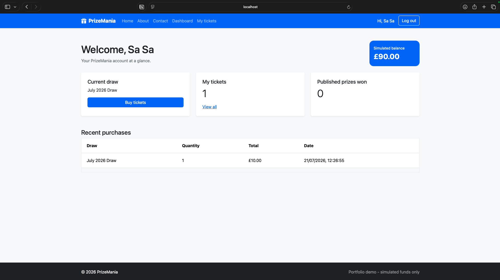
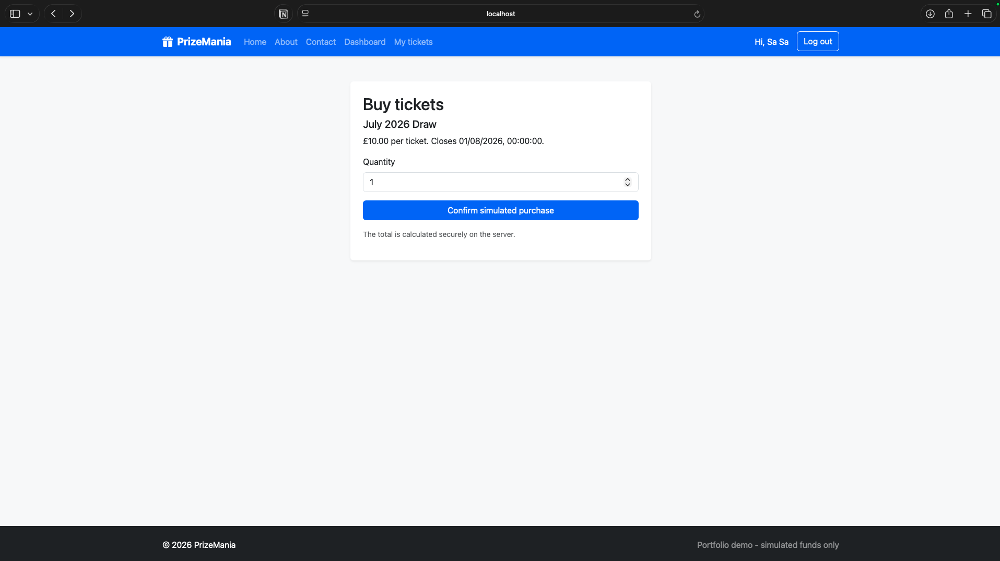
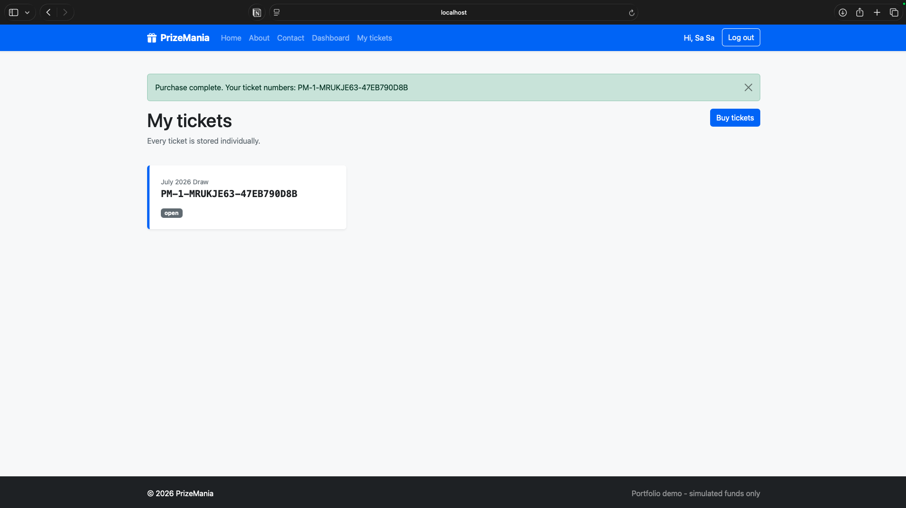
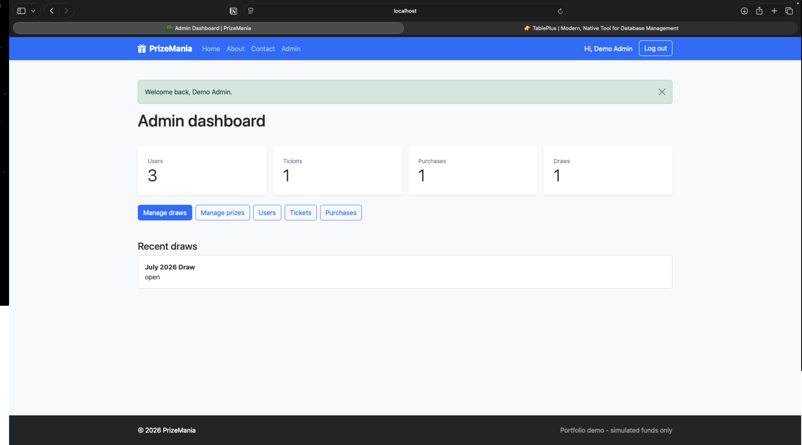
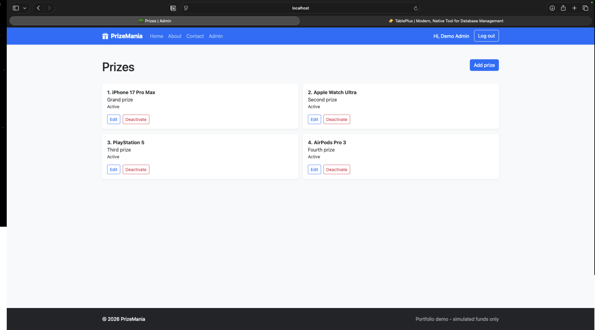
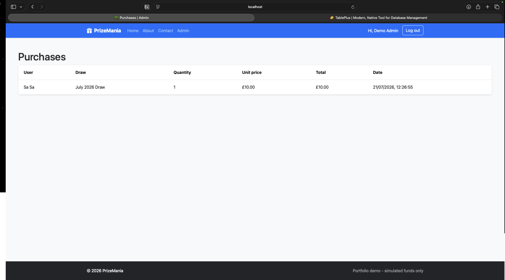
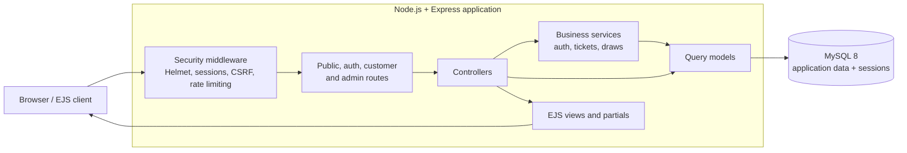
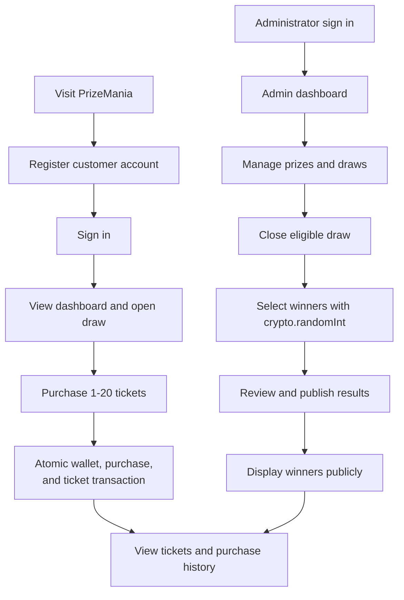
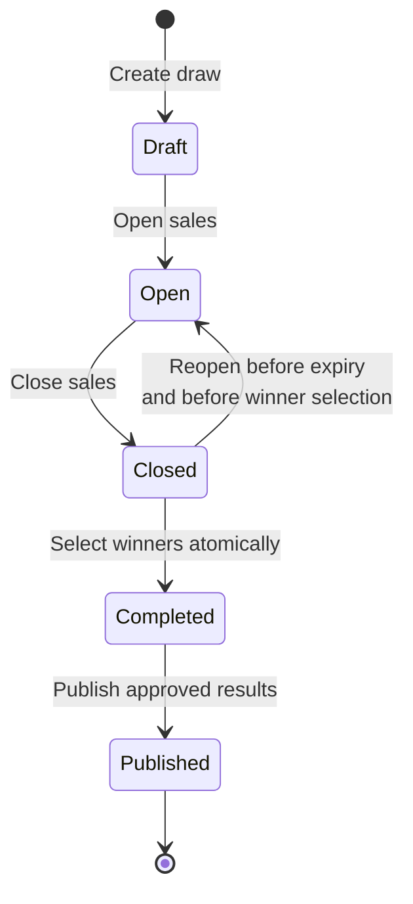
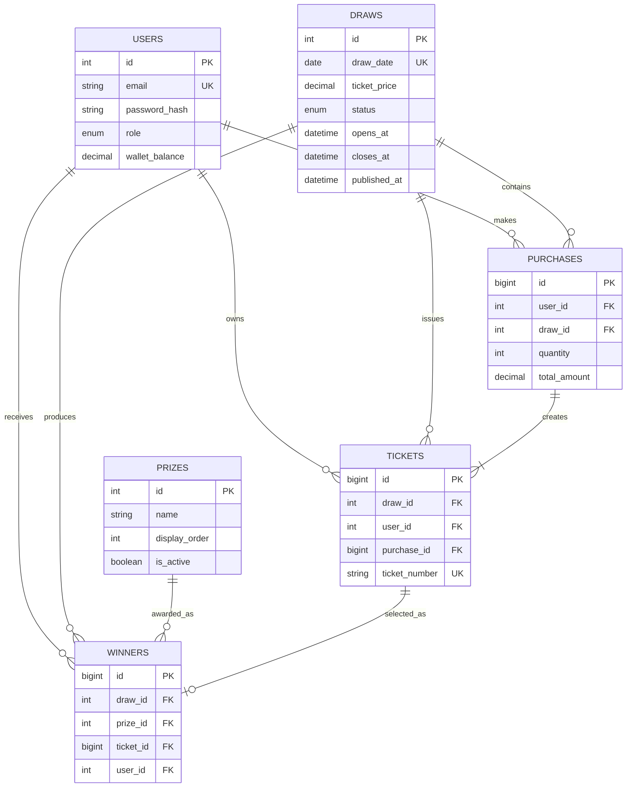

# PrizeMania V2

PrizeMania V2 is a full-stack lucky-draw platform built with Node.js, Express, EJS, and MySQL. It modernizes an earlier PHP university project into a secure, responsive application with separate customer and administrator workflows.

The project is a portfolio demonstration. Purchases use simulated wallet funds only; it does not process real payments or store financial information.

## 🌐 Live application

[Open PrizeMania V2](https://prizemaniav2-production.up.railway.app)

## 📸 Screenshots

| Customer dashboard | Ticket purchase |
| --- | --- |
|  |  |

| Purchased ticket | Admin dashboard |
| --- | --- |
|  |  |

| Prize management | Purchase administration |
| --- | --- |
|  |  |

## ✨ Core features

### 👤 Customer experience

- Account registration and secure sign-in
- Dashboard with simulated wallet balance and current draw information
- Multi-ticket purchasing for open draws
- Individually generated ticket numbers
- Owned-ticket and purchase history
- Published prize and winner history
- Secure logout and session handling

### 🛡️ Administration

- Separate protected administrator sign-in
- Dashboard metrics for users, tickets, purchases, prizes, and draws
- User, ticket, and purchase records
- Prize creation, editing, ordering, activation, and deactivation
- Draw creation and controlled status transitions
- Ability to reopen an eligible closed draw before winner selection
- Cryptographically secure winner selection without replacement
- Explicit result publication before winners appear publicly

## 🧰 Technology

- Node.js and Express 5
- EJS server-rendered templates
- MySQL 8 with `mysql2/promise`
- Bootstrap 5 and custom CSS
- JavaScript and Node's built-in test runner
- Railway for application and database hosting

## 🏗️ Architecture

PrizeMania follows an MVC-oriented structure:

```text
config/       Database and session configuration
controllers/  HTTP request and response handling
database/     MySQL schema and development seed data
middleware/   Authentication, CSRF, flash, and error handling
models/       Parameterised database queries
public/       Stylesheets and image assets
routes/       Public, customer, authentication, and admin routes
services/     Authentication, purchasing, and draw business rules
test/         Automated unit and HTTP smoke tests
views/        EJS pages and shared partials
```

Controllers remain focused on HTTP concerns, models own database access, and services implement transactional business rules.

## 📐 System diagrams

These diagrams update the original project documentation to reflect the current Express MVC application, session security, transactional purchasing, and administrator-controlled draw lifecycle.

### 🧩 Application architecture



### 🔀 Customer and administrator journeys



### 🔄 Draw lifecycle



### 🗄️ Database relationships



## 📋 Business rules

- Only open, unexpired draws accept ticket purchases.
- Ticket quantity is limited to 1-20 per purchase request.
- Ticket prices and totals are calculated exclusively on the server.
- Wallet deduction, purchase creation, and ticket creation use one database transaction.
- Winner selection is allowed only for a closed draw.
- Winners are selected with `crypto.randomInt`, without replacement.
- A ticket cannot win twice in the same draw.
- A prize cannot be assigned twice in the same draw.
- Completed draws cannot be processed again.
- Results remain private until an administrator publishes them.

## 🔐 Security

- Password hashing with bcrypt cost factor 12
- MySQL-backed sessions with HTTP-only, SameSite cookies
- Secure cookies in production
- Session regeneration after successful authentication
- Role-based route authorization
- CSRF protection on state-changing forms
- Helmet security headers
- Authentication rate limiting
- Parameterised SQL queries
- Generic authentication and database error responses
- User-owned records scoped to the authenticated account

## 🚀 Local setup

### ✅ Prerequisites

- Node.js 20 or later
- npm
- MySQL 8 or later

### 📥 Clone the repository

```bash
git clone https://github.com/aminkhant1999/PrizeManiaV2.git
cd PrizeManiaV2
```

### 📦 Install dependencies

```bash
npm install
cp .env.example .env
```

Configure `.env` with your local database credentials and a random session secret:

```env
PORT=3000
NODE_ENV=development
SESSION_SECRET=replace-with-at-least-32-random-characters

DB_HOST=127.0.0.1
DB_PORT=3306
DB_USER=prizemania_app
DB_PASSWORD=your-local-database-password
DB_NAME=prizemania
```

Initialize the database:

```bash
mysql -u root -p < database/schema.sql
mysql -u root -p < database/seed.sql
```

Start the application:

```bash
npm start
```

Open [http://localhost:3000](http://localhost:3000).

## 👥 Development accounts

The seed file creates local demonstration accounts:

| Role | Email | Password |
| --- | --- | --- |
| Customer | `user@prizemania.test` | `UserPass123!` |
| Administrator | `admin@prizemania.test` | `AdminPass123!` |

These credentials are intended only for development and portfolio demonstrations.

## ⌨️ Commands

```bash
npm start       # Start the application
npm run dev     # Start with Nodemon
npm test        # Run automated tests
```

The repository also includes [MANUAL_TESTING.md](MANUAL_TESTING.md), covering the complete public, customer, and administrator journeys.

## 🧪 Testing

The automated suite covers validation, authentication behavior, authorization middleware, CSRF rejection, ticket quantity rules, ticket-number generation, winner sampling, public form rendering, health checks, and 404 handling.

```bash
npm test
```

## ☁️ Deployment

The application is designed to run as a Node web service alongside MySQL. Production configuration is provided through environment variables; secrets and database credentials are never committed to the repository.

The deployed service exposes a lightweight health endpoint:

```text
GET /health
```

## 📌 Project status

PrizeMania V2 implements the complete demonstration workflow from registration and ticket purchase through administrator-managed draws, winner selection, and public result publication.

Potential future enhancements include notification delivery, image uploads, audit-event history, pagination for large datasets, and expanded browser-level end-to-end coverage.

## 📄 License

This project is currently provided for portfolio and demonstration purposes.
